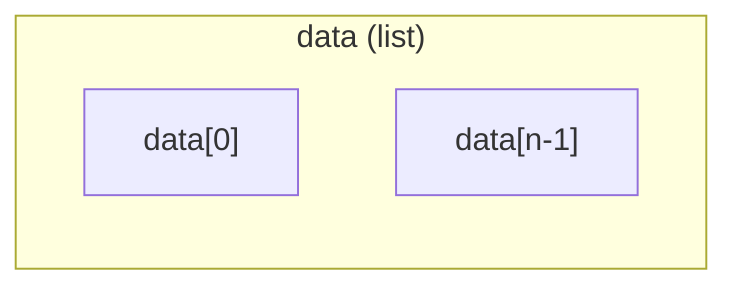
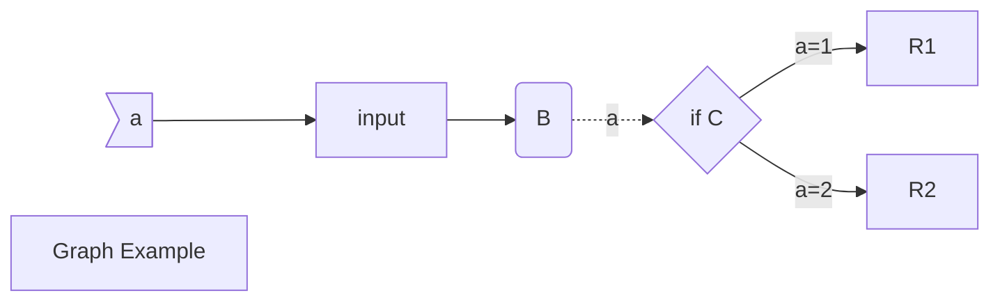
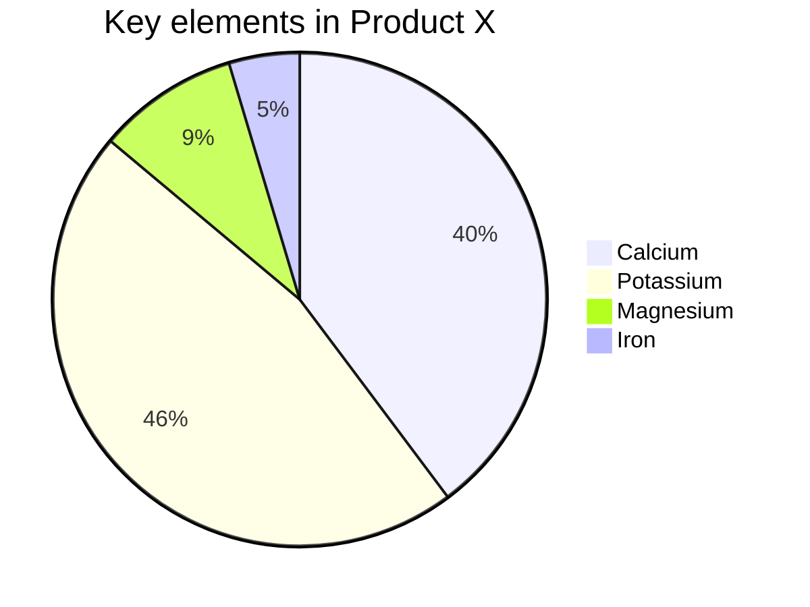
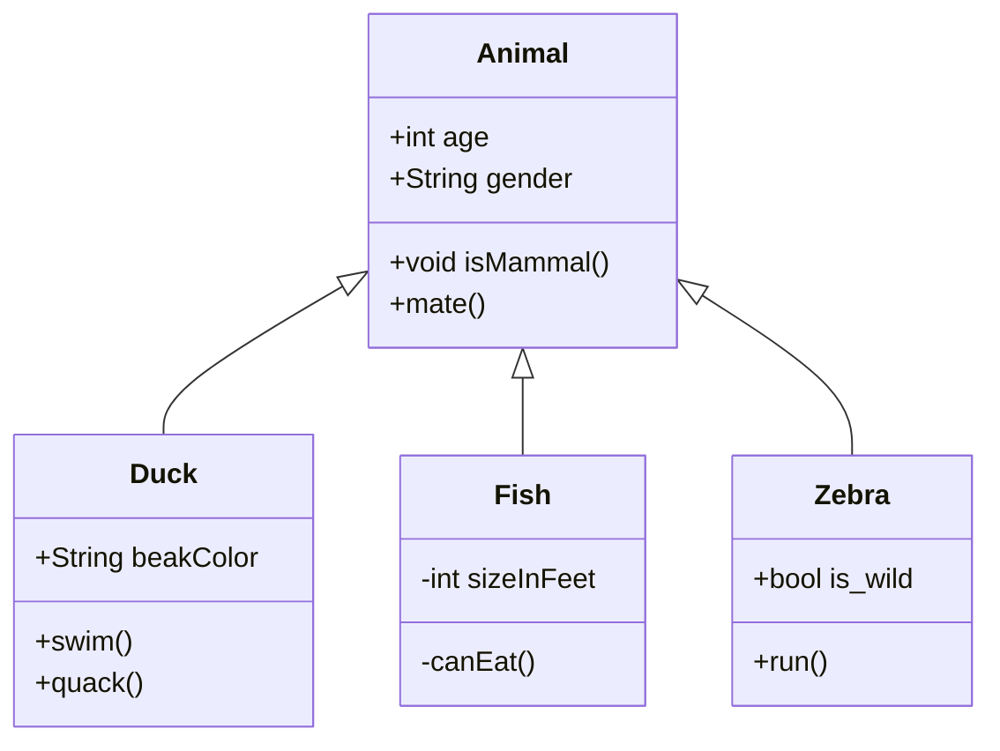

# Details for Project Code

This document is written for recording all of design details of project, named Theory of Mind based RL on Dialogue System.

## Neural Network

This part discribe what the structures of neural network in the project.

### Types of NN

1. Supervise Learning Agent
2. Theory of Mind Model
3. Policy Network
4. Value Network

#### Encoder

Input:

* Dialogue Act
* Dialogue Utterance
* Last Hidden State  
  * t-1
  * from t-1, for history state
* Other Information

Output:

* State Embedding
* Current Hidden State

#### Decoder

Input:

* State Embedding
* Price Information
* Other Information

Output:

* Intent (+ Price Value)

  or

* Intent  + Price Action

### Actor (Policy)

Encoder+Actor-Decoder

#### Actor-Encoder

Input: State

#### Actor-Decoder 

Input:

* embedding vector from Encoder

Output:

* Intent distribution vector

* Price ( deterministic function )

TODO: 

- [ ] Using DDPG to get price
- [ ] Looking for other mixed-action agent

### Critic (Q-function)

#### Critic-Encoder

Input: State + Action

#### Critic-Decoder

Input:

* embedding vector from Encoder

Output:

* Value function

### Encoder

Input:

* State: 
  * last `k` steps dialogue history 
  * common knowledge
* Action: 
  * Intent:
    * One-hot vector or an integer 
    * Course Dialogue Act, including normal intent and intent without price
  * Price: 
    * A continous value, or
    * N/A, when intent do not need price

### Theory of Mind Model 

Not implemented yet.

## Data Structures  

All the data structures invloved in this project.

### Raw Dataset

`json` type, could be read by python

Load as data

``` python
>>> type(data)
list
>>> type(data[0])
dict
>>> data[0].keys()
dict_keys(['events', 'agents', 'scenario', 'uuid', 'scenario_uuid', 'outcome', 'agents_info'])
>>> data[0]['scenario'].keys()
dict_keys(['kbs', 'uuid', 'post_id', 'attributes', 'category'])
>>> len(data[0]['scenario']['kbs'])
2
>>> data[0]['scenario']['kbs'][0]
{'item': {'Category': 'electronics',
  'Price': 265,
  'Title': 'xxx',
  'Images': ['electronics/6122134540_0.jpg'],
  'Description': ['xxx', "xxx",]},
 'personal': {'Target': 243, 'Role': 'buyer', 'Bottomline': None}}
>>> data[0]['events'][0]
{'time': '1496341531.17',
 'metadata': {'intent': 'greet', 'price': None},
 'start_time': '1496341530.27',
 'agent': 0,
 'data': 'hi there',
 'action': 'message'}
>>> data[0]['events'][-1]
{'time': '1496341763.62',
 'metadata': {'intent': 'accept'},
 'start_time': None,
 'agent': 0,
 'data': None,
 'action': 'accept'}
```




### Data structure transform flow

- ```mermaid
  graph LR
  	json --> Example
  	Example -->|preprocessor| Dialogue
  	Dialogue -->|batcher| Batch
  ```

### 

- Load dataset: Raw Dataset -> `Dialogue`
- Generate Batch as Input:  `Dialogue` -> `Batch`
- Transfer Action as Dialogue: `(Intent, Price)` -> `Dialogue`
- Search in ToM inference process

#### Raw Dataset -> `Dialogue`

* Read json into `Example`
* Add each event in `Example` to Dialogue by `Dialogue.add_utterance()` .

#### `Dialogue` -> `Batch`

**In SL part:** 

​	In `DataGenerator.convert_to_int() `: Execute `Dialogue.convert_to_int()`, then `Dialogue.pad_turns()`

**In RL part:**

​	In  `NeuralSession.convert_to_int()` and no `Dialogue.pad_turns()`

#### `(Intent, Price)`->`Dialogue`


### Search in ToM inference process

state u0 -> u1

(State, u0) for agent1 get u1

((State, u0), u1) for agent 0 get value function

#### Inference Formula

Using the formula above to inferance a new action
$$
\pi(a|s) = \pi_1(a|s)\pi_2(a|s)
$$

$$
\pi_2(a|s) = \exp(G(a|s)) / \exp(\Sigma_{a'\in A}(G(a'|s)))
$$

$$
G(a|s) = \Sigma_{a'\in A} P(a'|s,a) V(s,a,a')
$$


#### Enumerate all actions

For 2nd and 3rd formula above, there need to be enumerated all avaliable actions.

## Structures in project

### Dataset ralated whole dialogue

#### Senario

#### Example

#### Preprocessor

#### Dialogue

One dialogue class has a related agent, which will decide the number of price in *Dialogue Act*(4).

For one scentence:

1. **Utterance**, called `token_turns`

   ['It', 'worth', '$300']

2. **Utterance tokens without numbers**, called `tokens`

   [3, 11]

3. **Universal Dialogue Act**, called `lf_turns`

   Example: (‘counter’, 1500) or (1, 1500)

4. **Dialogue Act**, called `lfs`

   The price here will be processed by `PriceScaler.scale_price(self.kb, price)`

   Example: (2, 0.5)

### Classes about price

#### Class PriceList

#### Class PriceScaler

#### Class PriceTracker


## 

## Reinforcement Learning Related Agent Settings

### Reinforce

### Actor-Critic

### Replay buffer

### Mixed action policy

### ToM inference

### Details for ToM Inference

#### Case 1: `a = 'accept' or 'reject'`

This case is available  when `s[-1]` is `'offer'`. 

In this case, `a'` will not exist and only 2 calculations.

$\sum P(a'|s)V(s,a,a') = R(s,a)$, where `R(s,a)` is given by rule. 

#### Case 2: `a = 'offer'`

In this case, `a'` could only be `'accept'` or `'reject'`, also only 2 calculations.

$\sum P(a'|s)V(s,a,a') = \sum P(a'|s,a)R(s,a,a')$, where `R(s,a,a')` is given by rule and `P(a'|s,a)` is obtained from ToM. 

####  Case 3: `a = others`

In this case, `a'` could be any possible actions.

Using batch calculation.


## Game Environment Settings

## Experiment Settings

# Working Progress

## SL part

- [x] Check utter vocab with <unknown>
  - [ ] Numbers in utterance
- [x] Batch from dialogue
- [ ] NN model

## RL part

- [ ] Generate Language
- [ ] Replay buffer

## ToM part

- [ ] Inference

- [ ] Mixed population





